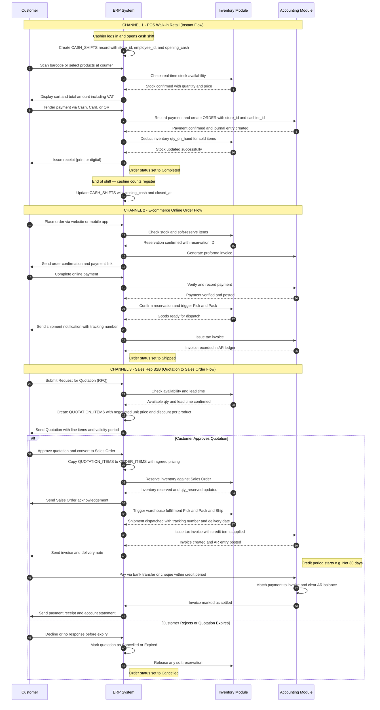
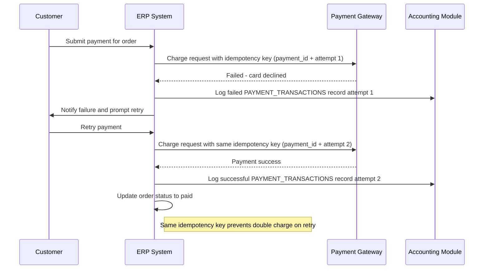
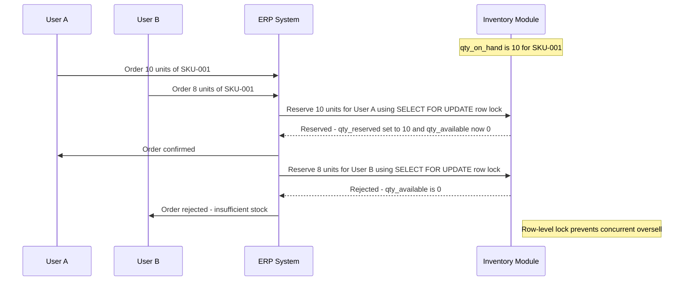
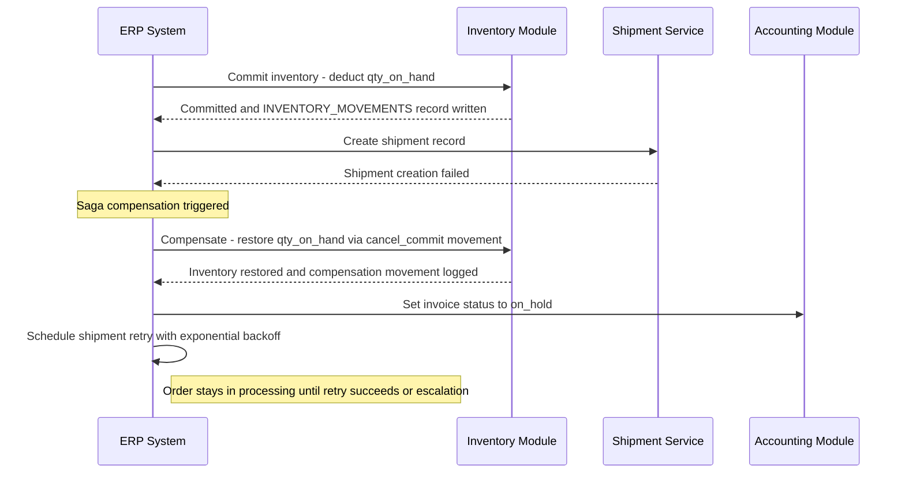

# Part 2: Business Workflow — ABC Trading ERP System

## Sequence Diagram



---

## Flow Summary Table

| Step | POS | E-commerce | Sales Rep (B2B) |
|------|-----|------------|-----------------|
| **Order Creation** | Instant scan at counter (store_id + cashier_id recorded) | Online cart checkout | Request for Quotation (RFQ) |
| **Inventory Check** | Real-time at POS | Real-time + soft reserve | Check availability + lead time |
| **Pricing** | Fixed retail price | Fixed retail price | Negotiated per product via QUOTATION_ITEMS |
| **Approval Step** | None | None | Quotation requires customer approval |
| **Payment Timing** | Immediate at counter | Before shipment (online) | After delivery within credit period |
| **Fulfillment** | Customer takes goods instantly | Warehouse picks and ships | Warehouse picks and ships |
| **Cashier Tracking** | Shift opened/closed per session (CASH_SHIFTS) | N/A | N/A |
| **Invoice** | Receipt issued instantly | Tax invoice after payment | Tax invoice with credit terms |
| **Settlement** | Immediate | Immediate | Within credit period (Net 30 or Net 60) |

---

## Status Lifecycles

### Order Status
```
pending -> paid -> shipped -> completed
       \-> cancelled (before shipped)
```

### Quotation Status (B2B only)
```
draft -> sent -> approved -> [converted to Sales Order]
              \-> rejected
              \-> expired
```

### Payment Status
```
pending -> success
       \-> failed -> [retry]
```

### Inventory Reservation
```
available -> soft_reserved (on order or quotation)
          -> committed (deducted on shipment)
          \-> released (on cancellation)
```

---

## Failure Scenarios

### Scenario 1: Payment Failure and Retry



### Scenario 2: Inventory Conflict - Oversell Prevention



### Scenario 3: Shipment Failure - Saga Compensation



---

## Event-Driven Flow

Domain events decouple modules and guarantee reliable async processing.

```
Event                   Consumers
────────────────────────────────────────────────────────────────
OrderCreated         -> Inventory: ReserveStock
PaymentSuccess       -> Order: SetStatus(paid)
                     -> Inventory: CommitStock
                     -> Shipment: CreateShipment
                     -> Accounting: IssueInvoice
ShipmentCreated      -> Notification: NotifyCustomer(shipped)
ShipmentFailed       -> Inventory: RollbackCommit (cancel_commit)
                     -> Accounting: PutInvoiceOnHold
                     -> Order: ScheduleRetry
OrderCancelled       -> Inventory: ReleaseReservation
                     -> Accounting: VoidInvoice
PaymentFailed        -> Notification: NotifyCustomer(retry)
                     -> Order: SchedulePaymentRetry
```

---

## Inventory State Transitions

Every state change writes an immutable record to INVENTORY_MOVEMENTS.

```
AVAILABLE
  |-- [order confirmed]       --> SOFT_RESERVED  (movement_type: order_reserve)
  |-- [order cancelled]       --> AVAILABLE       (movement_type: cancel)

SOFT_RESERVED
  |-- [payment confirmed]     --> COMMITTED       (movement_type: order_commit)
  |-- [order cancelled]       --> AVAILABLE       (movement_type: cancel)

COMMITTED
  |-- [shipment dispatched]   --> FULFILLED        qty_on_hand decremented
  |-- [shipment failed]       --> SOFT_RESERVED   (movement_type: cancel_commit)
```
