# Part 1 (Example): ER Diagram with Sample Data — ABC Trading ERP System

> This file mirrors `er-diagram.md` exactly in schema structure.
> Each field includes an inline example value to illustrate realistic data.
> Use this file to walk through data flow during an interview or review session.

---

## Entity Relationship Diagram — with Example Values

```mermaid
erDiagram
    CATEGORIES {
        int      category_id   PK    "101"
        varchar  name                "Beverages"
        varchar  description         "Soft drinks, water, and juices"
        datetime created_at          "2026-01-10 08:00:00"
    }

    PRODUCTS {
        int      product_id    PK    "2001"
        int      category_id   FK    "101"
        varchar  sku           UK    "BEV-MW500-001"
        varchar  name                "Mineral Water 500ml"
        text     description         "Still mineral water, 500ml bottle"
        decimal  base_price          "12.00"
        varchar  unit                "bottle"
        boolean  is_active           "true"
        datetime created_at          "2026-01-10 09:00:00"
        datetime updated_at          "2026-05-01 10:00:00"
    }

    WAREHOUSES {
        int      warehouse_id    PK    "301"
        int      store_id        FK    "401"
        varchar  name                  "Sukhumvit Branch Warehouse"
        varchar  location              "Sukhumvit Soi 21, Bangkok"
        varchar  contact_person        "Somchai Thongdee"
        boolean  is_active             "true"
        datetime created_at            "2026-01-15 08:00:00"
    }

    STORES {
        int      store_id   PK    "401"
        varchar  name             "ABC Trading - Sukhumvit Branch"
        varchar  location         "Sukhumvit Soi 21, Bangkok"
        boolean  is_active        "true"
        datetime created_at       "2026-01-15 08:00:00"
    }

    %% Cash must be tracked per terminal, not per store; each physical register has its own session
    POS_TERMINALS {
        int      terminal_id   PK    "2001"
        int      store_id      FK    "401"
        varchar  name                "POS-01"
        boolean  is_active           "true"
        datetime created_at          "2026-01-15 09:00:00"
    }

    %% qty_available is DERIVED: qty_on_hand - qty_reserved (computed at read time, never persisted)
    INVENTORY {
        int      inventory_id   PK    "501"
        int      product_id     FK    "2001"
        int      warehouse_id   FK    "301"
        int      qty_on_hand          "240"
        int      qty_reserved         "10"
        int      reorder_level        "50"
        datetime last_updated         "2026-05-15 11:00:00"
    }

    SALES_CHANNELS {
        int      channel_id   PK    "601"
        varchar  name               "POS"
        varchar  description        "Walk-in retail at physical store"
        boolean  is_active          "true"
        datetime created_at         "2026-01-01 00:00:00"
    }

    SALES_REPS {
        int      sales_rep_id   PK    "701"
        varchar  employee_code  UK    "SR-001"
        varchar  full_name            "Prasit Wannapong"
        varchar  email                "prasit.w@abctrading.co.th"
        varchar  phone                "081-234-5678"
        varchar  region               "Bangkok North"
        boolean  is_active            "true"
        datetime created_at           "2026-02-01 09:00:00"
    }

    EMPLOYEES {
        int      employee_id   PK    "801"
        varchar  name                "Maria Johnson"
        varchar  role                "cashier"
        varchar  email               "maria.j@abctrading.co.th"
        boolean  is_active           "true"
        datetime created_at          "2026-03-01 09:00:00"
    }

    CUSTOMERS {
        int      customer_id    PK    "901"
        varchar  name                 "Somying Kaewkla"
        varchar  email          UK    "somying.k@email.com"
        varchar  phone                "089-876-5432"
        varchar  tax_id               "1234567890123"
        varchar  customer_type        "Retail"
        decimal  credit_limit         "0.00"
        int      credit_days          "0"
        boolean  is_active            "true"
        datetime created_at           "2026-04-10 14:00:00"
        datetime updated_at           "2026-04-10 14:00:00"
    }

    ADDRESSES {
        int      address_id    PK    "1001"
        int      customer_id   FK    "901"
        varchar  address_type        "shipping"
        varchar  line1               "45/2 Soi Aree"
        varchar  line2               "Phahon Yothin Rd"
        varchar  city                "Bangkok"
        varchar  province            "Bangkok"
        varchar  postal_code         "10400"
        varchar  country             "Thailand"
        boolean  is_default          "true"
        datetime created_at          "2026-04-10 14:00:00"
    }

    ORDERS {
        int      order_id          PK    "1101"
        int      customer_id       FK    "901"
        int      channel_id        FK    "601"
        int      store_id          FK    "401"
        int      cashier_id        FK    "801"
        int      shift_id          FK    "2101"
        int      sales_rep_id      FK    "NULL"
        int      shipping_addr_id  FK    "NULL"
        int      quotation_id      FK    "NULL"
        datetime order_date              "2026-05-15 12:05:00"
        varchar  status                  "completed"
        decimal  subtotal                "48.00"
        decimal  tax_amount              "3.36"
        decimal  discount_amount         "0.00"
        decimal  shipping_amount         "0.00"
        decimal  total_amount            "51.36"
        varchar  remarks                 "POS walk-in"
        varchar  created_by              "maria.j@abctrading.co.th"
        datetime created_at              "2026-05-15 12:05:00"
        datetime updated_at              "2026-05-15 12:06:00"
    }

    ORDER_ITEMS {
        int      order_item_id  PK    "1201"
        int      order_id       FK    "1101"
        int      product_id     FK    "2001"
        int      quantity             "4"
        decimal  unit_price           "12.00"
        decimal  discount_pct         "0.00"
        decimal  subtotal             "48.00"
        datetime created_at           "2026-05-15 12:05:00"
    }

    %% QUOTATION is a pre-order document; on approval a new ORDER is created referencing it via quotation_id
    QUOTATIONS {
        int      quotation_id  PK    "1301"
        int      customer_id   FK    "902"
        int      sales_rep_id  FK    "701"
        datetime valid_until         "2026-06-01 23:59:59"
        varchar  status              "approved"
        varchar  remarks             "Bulk order for Q2 2026"
        datetime created_at          "2026-05-10 10:00:00"
        datetime updated_at          "2026-05-12 15:00:00"
    }

    QUOTATION_ITEMS {
        int      quotation_item_id  PK    "1401"
        int      quotation_id       FK    "1301"
        int      product_id         FK    "2001"
        int      quantity                 "500"
        decimal  unit_price               "9.50"
        decimal  discount_pct             "20.83"
        decimal  subtotal                 "4750.00"
        datetime created_at               "2026-05-10 10:05:00"
    }

    PAYMENTS {
        int      payment_id    PK    "1501"
        int      order_id      FK    "1101"
        decimal  amount              "51.36"
        varchar  method              "cash"
        varchar  status              "success"
        varchar  reference_no  UK    "CASH-20260515-0001"
        datetime paid_at             "2026-05-15 12:06:00"
        varchar  remarks             "POS cash payment"
        datetime created_at          "2026-05-15 12:06:00"
    }

    INVOICES {
        int      invoice_id    PK    "1601"
        int      order_id      FK    "1101"
        varchar  invoice_no    UK    "INV-2026-001101"
        datetime invoice_date        "2026-05-15 12:06:00"
        datetime due_date            "2026-05-15 12:06:00"
        decimal  total_amount        "51.36"
        decimal  paid_amount         "51.36"
        varchar  status              "paid"
        datetime created_at          "2026-05-15 12:06:00"
        datetime updated_at          "2026-05-15 12:06:00"
    }

    SHIPMENTS {
        int      shipment_id   PK    "1701"
        int      order_id      FK    "1102"
        int      warehouse_id  FK    "301"
        int      address_id    FK    "1001"
        varchar  tracking_no   UK    "TH1234567890"
        varchar  carrier             "Thailand Post"
        varchar  status              "delivered"
        datetime shipped_at          "2026-05-15 15:00:00"
        datetime delivered_at        "2026-05-16 10:30:00"
        datetime created_at          "2026-05-15 14:50:00"
    }

    %% POS — cashier session management; shift represents a session on a specific POS terminal
    CASH_SHIFTS {
        int      shift_id       PK    "2101"
        int      terminal_id    FK    "2001"
        int      employee_id    FK    "801"
        decimal  opening_cash         "2000.00"
        decimal  closing_cash         "5386.00"
        datetime opened_at            "2026-05-15 08:00:00"
        datetime closed_at            "2026-05-15 17:00:00"
    }

    %% Append-only audit / event-log tables (INSERT only, never updated)
    INVENTORY_MOVEMENTS {
        int      movement_id    PK    "1801"
        int      product_id     FK    "2001"
        int      warehouse_id   FK    "301"
        int      change_qty           "-4"
        varchar  movement_type        "order_commit"
        int      reference_id         "1101"
        varchar  reference_type       "order"
        varchar  created_by           "maria.j@abctrading.co.th"
        datetime created_at           "2026-05-15 12:06:00"
    }

    PAYMENT_TRANSACTIONS {
        int      transaction_id    PK    "1901"
        int      payment_id        FK    "1501"
        int      attempt_no              "1"
        varchar  gateway_ref             "NULL"
        varchar  gateway_response        "cash_accepted"
        varchar  status                  "success"
        datetime created_at              "2026-05-15 12:06:00"
    }

    %% Product catalog and inventory
    CATEGORIES     ||--o{ PRODUCTS      : "categorizes"
    PRODUCTS       ||--o{ INVENTORY     : "tracked in"
    WAREHOUSES     ||--o{ INVENTORY     : "stores"

    %% Customer and address
    CUSTOMERS      ||--o{ ADDRESSES     : "has"
    CUSTOMERS      ||--o{ ORDERS        : "places"
    CUSTOMERS      ||--o{ QUOTATIONS    : "requests"

    %% Order core relations
    SALES_CHANNELS ||--o{ ORDERS        : "channel for"
    SALES_REPS     ||--o{ ORDERS        : "manages"
    ADDRESSES      ||--o{ ORDERS        : "ships to"
    ORDERS         ||--o{ ORDER_ITEMS   : "contains"
    PRODUCTS       ||--o{ ORDER_ITEMS   : "included in"

    %% B2B quotation flow - QUOTATION precedes ORDER; ORDERS.quotation_id (nullable) references source
    SALES_REPS      ||--o{ QUOTATIONS       : "creates"
    QUOTATIONS      ||--o{ QUOTATION_ITEMS  : "contains"
    PRODUCTS        ||--o{ QUOTATION_ITEMS  : "included in"
    QUOTATIONS      ||--o| ORDERS           : "converts to"

    %% Financial records
    ORDERS         ||--o{ PAYMENTS      : "paid via"
    ORDERS         ||--o| INVOICES      : "invoiced as"

    %% Fulfillment
    ORDERS         ||--o{ SHIPMENTS     : "fulfilled via"
    WAREHOUSES     ||--o{ SHIPMENTS     : "dispatched from"
    ADDRESSES      ||--o{ SHIPMENTS     : "delivered to"

    %% Audit logs - append-only; never updated; full traceability
    PRODUCTS       ||--o{ INVENTORY_MOVEMENTS  : "logged in"
    WAREHOUSES     ||--o{ INVENTORY_MOVEMENTS  : "tracked in"
    PAYMENTS       ||--o{ PAYMENT_TRANSACTIONS : "attempted via"

    %% POS operations — store, terminal, cashier, and shift management
    STORES        ||--o{ WAREHOUSES    : "contains"
    STORES        ||--o{ ORDERS        : "originates"
    STORES        ||--o{ POS_TERMINALS : "has"
    EMPLOYEES     ||--o{ ORDERS        : "processed by"
    POS_TERMINALS ||--o{ CASH_SHIFTS   : "runs on"
    EMPLOYEES     ||--o{ CASH_SHIFTS   : "operates"
    CASH_SHIFTS   ||--o{ ORDERS        : "processed in"
```



---

## Sample Data Walkthrough

### Scenario: POS Walk-in Purchase at Sukhumvit Branch

| Step | Entity | Key Values |
|------|--------|-----------|
| **1. Store opens** | `STORES` | store_id=401 · "ABC Trading - Sukhumvit Branch" |
| **2. Terminal starts** | `POS_TERMINALS` | terminal_id=2001 · "POS-01" · store_id=401 |
| **3. Cashier opens shift** | `CASH_SHIFTS` | shift_id=2101 · terminal_id=2001 · employee_id=801 · opening_cash=2000.00 |
| **4. Customer selects product** | `PRODUCTS` / `INVENTORY` | product_id=2001 · "Mineral Water 500ml" · qty_on_hand=240 |
| **5. Order created** | `ORDERS` | order_id=1101 · channel_id=601 (POS) · store_id=401 · cashier_id=801 · shift_id=2101 |
| **6. Line item recorded** | `ORDER_ITEMS` | 4 × Mineral Water 500ml @ 12.00 = subtotal 48.00 |
| **7. Payment collected** | `PAYMENTS` | payment_id=1501 · cash · 51.36 · status=success |
| **8. Stock deducted** | `INVENTORY_MOVEMENTS` | change_qty=-4 · movement_type=order_commit · reference_id=1101 |
| **9. Receipt issued** | `INVOICES` | invoice_no=INV-2026-001101 · total=51.36 · paid=51.36 · status=paid |
| **10. Cashier closes shift** | `CASH_SHIFTS` | closing_cash=5386.00 · closed_at=17:00 |

---

### Key FK Chain for a POS Order

```
STORES (401)
  └── POS_TERMINALS (2001 · POS-01)
        └── CASH_SHIFTS (2101 · Maria Johnson · opened 08:00)
              └── ORDERS (1101 · 2026-05-15 12:05 · channel=POS)
                    ├── ORDER_ITEMS (1201 · 4 × Mineral Water · 48.00)
                    ├── PAYMENTS (1501 · cash · 51.36 · success)
                    │     └── PAYMENT_TRANSACTIONS (1901 · attempt 1 · success)
                    └── INVOICES (1601 · INV-2026-001101 · paid)

INVENTORY (501 · product=2001 · warehouse=301)
  └── INVENTORY_MOVEMENTS (1801 · -4 · order_commit · ref=order:1101)
```
