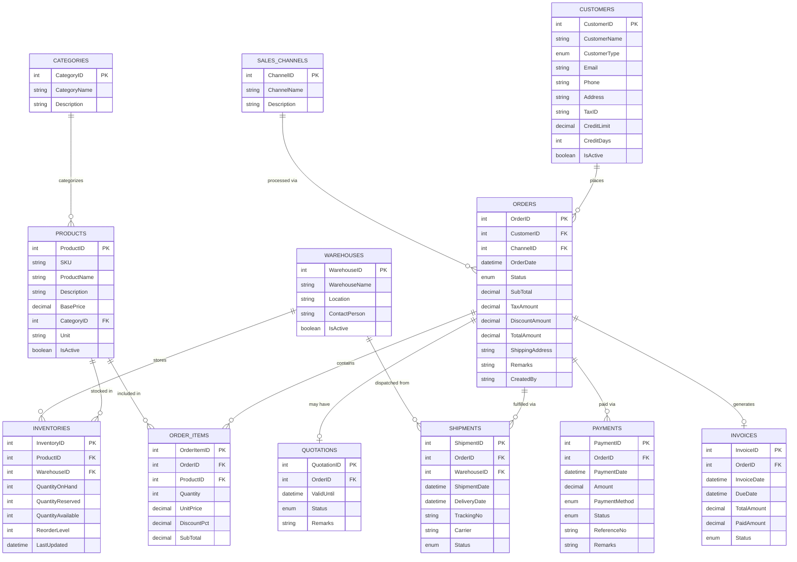

# Part 1: ER Diagram — ABC Trading ERP System

## Entity Relationship Diagram

---

## Entity Descriptions

| Entity | Description |
|---|---|
| **CATEGORIES** | Product category/group (e.g., Beverages, Snacks) |
| **PRODUCTS** | Master product catalog with SKU and base price |
| **WAREHOUSES** | Physical storage locations |
| **INVENTORIES** | Junction table bridging Products ↔ Warehouses (many-to-many); tracks real-time stock levels |
| **CUSTOMERS** | Both Retail (POS/E-commerce) and Wholesale (B2B) customers |
| **SALES_CHANNELS** | `POS`, `SalesRep`, `Ecommerce` |
| **ORDERS** | Master order record across all channels; `Status` = Draft / Confirmed / Processing / Shipped / Delivered / Cancelled |
| **ORDER_ITEMS** | Line items within an order |
| **QUOTATIONS** | Applies to Sales Rep (B2B) channel; converts to confirmed Order on approval |
| **PAYMENTS** | Payment records; `PaymentMethod` = Cash / CreditCard / BankTransfer / QR |
| **INVOICES** | Tax invoices linked to orders; tracks outstanding balances (AR) |
| **SHIPMENTS** | Fulfillment records; tracks dispatch from specific warehouse with carrier & tracking |

---

## Key Design Decisions

- **INVENTORIES** acts as a **junction table** (many-to-many) between PRODUCTS and WAREHOUSES, also storing live stock quantities.
- **CUSTOMERS.CustomerType** = `Retail` | `Wholesale` — drives credit terms and pricing tiers.
- **ORDERS.ChannelID** (FK → SALES_CHANNELS) is the single source of truth for which channel originated the order, enabling unified sales reporting.
- **QUOTATIONS** is a sub-entity of ORDERS, used exclusively in the Sales Rep workflow before order confirmation.
- **QuantityAvailable** in INVENTORIES is a computed/maintained field: `QuantityOnHand − QuantityReserved`.
