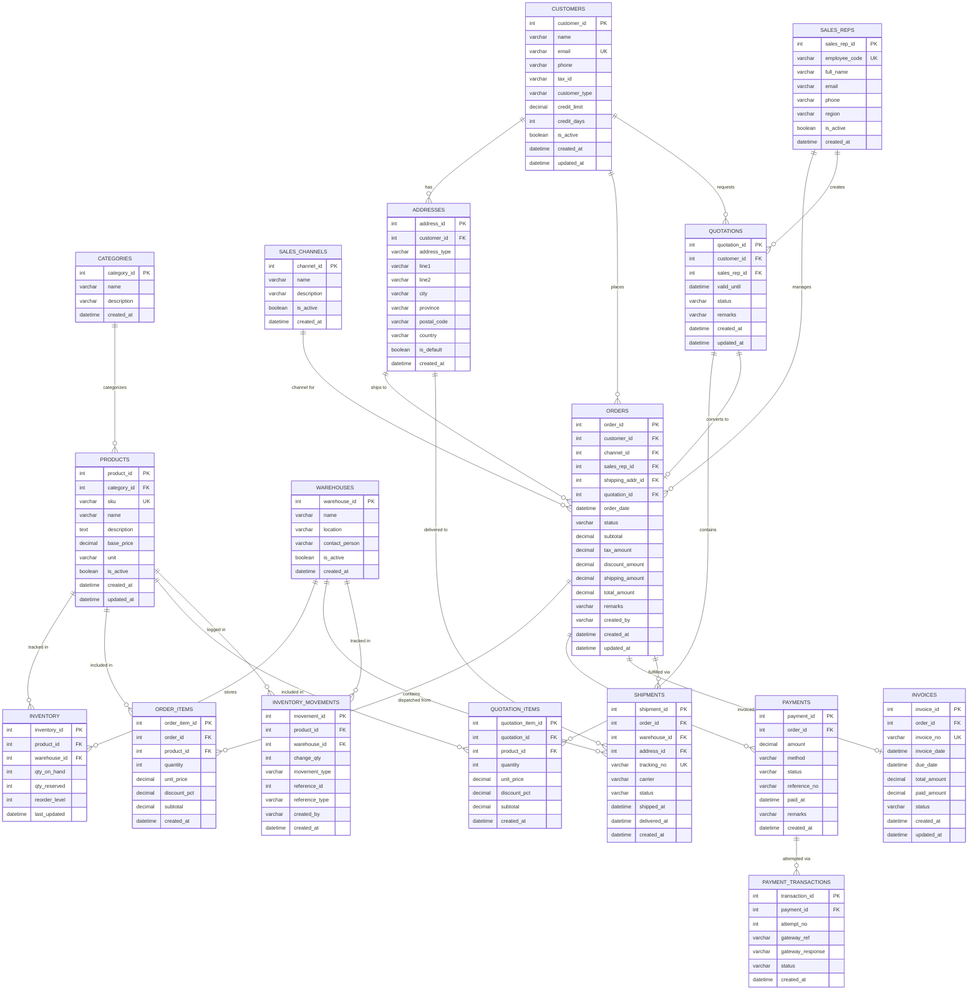

# Part 1: ER Diagram — ABC Trading ERP System

## Entity Relationship Diagram

---

## Entity Descriptions

| Entity | Key Attributes | Description |
|--------|---------------|-------------|
| **CATEGORIES** | `category_id`, `name` | Product groupings (e.g., Beverages, Snacks) |
| **PRODUCTS** | `sku` (UK), `base_price`, `category_id` | Master product catalog; no stock stored here |
| **WAREHOUSES** | `warehouse_id`, `location` | Physical storage locations |
| **INVENTORY** | `qty_on_hand`, `qty_reserved` | Junction table (Products ↔ Warehouses); tracks live stock. `qty_available` is **derived** (`qty_on_hand - qty_reserved`), never persisted |
| **SALES_CHANNELS** | `name` — POS / SalesRep / Ecommerce | Channel master; extensible for future channels |
| **SALES_REPS** | `employee_code` (UK), `region` | Field sales representatives for B2B orders |
| **CUSTOMERS** | `customer_type` — Retail / Wholesale, `credit_limit`, `credit_days` | All customer accounts across channels |
| **ADDRESSES** | `address_type` — billing / shipping, `is_default` | Multiple addresses per customer; used for both ORDER and SHIPMENT |
| **ORDERS** | `channel_id`, `sales_rep_id` (nullable), `quotation_id` (nullable), `shipping_amount` | Unified order record; `total_amount = subtotal - discount_amount + tax_amount + shipping_amount` |
| **ORDER_ITEMS** | `quantity`, `unit_price`, `discount_pct` | Line items resolving many-to-many between ORDERS and PRODUCTS |
| **QUOTATIONS** | `customer_id`, `sales_rep_id`, `valid_until`, `status` | Pre-order document with its own line items (QUOTATION_ITEMS). On approval, a new ORDER is created referencing `quotation_id`; ORDER_ITEMS are populated from QUOTATION_ITEMS |
| **QUOTATION_ITEMS** | `quotation_id`, `product_id`, `quantity`, `unit_price`, `discount_pct` | Line items within a quotation; mirrors ORDER_ITEMS structure; enables pre-sales pricing negotiation per product |
| **PAYMENTS** | `method` — cash / credit_card / transfer / qr, `status` — pending / success / failed, `paid_at` | Multiple payments per order (supports partial / split payment) |
| **INVOICES** | `invoice_no` (UK), `due_date`, `paid_amount` | Tax invoices; tracks Accounts Receivable balance |
| **SHIPMENTS** | `tracking_no` (UK), `carrier`, `shipped_at`, `delivered_at` | Fulfillment records per warehouse dispatch |
| **INVENTORY_MOVEMENTS** | `change_qty`, `movement_type`, `reference_id`, `reference_type` | Append-only stock audit log. `movement_type` values: `order_reserve`, `order_commit`, `cancel`, `cancel_commit`, `adjustment`, `return` |
| **PAYMENT_TRANSACTIONS** | `attempt_no`, `gateway_ref`, `gateway_response`, `status` | Append-only log of every gateway call per PAYMENT; enables retry tracking, idempotency verification, and dispute resolution |

---

## Key Design Decisions

| Decision | Rationale |
|----------|-----------|
| **INVENTORY as junction table** | Many-to-many between PRODUCTS and WAREHOUSES; stock never stored in PRODUCTS |
| **`qty_available` not persisted** | Computed as `qty_on_hand - qty_reserved` at query time; persisting it risks stale reads under concurrent writes |
| **INVENTORY_MOVEMENTS as append-only log** | Separates current state (INVENTORY) from history (MOVEMENTS); enables fast reads, full audit trail, and stock reconciliation without touching INVENTORY |
| **PAYMENT_TRANSACTIONS separate from PAYMENTS** | PAYMENTS = logical payment intent; PAYMENT_TRANSACTIONS = physical gateway attempt. Retries add a new row rather than mutating the payment record — supports idempotency and dispute resolution |
| **QUOTATIONS independent of ORDERS** | QUOTATION is a pre-order document owned by CUSTOMERS; ORDERS.quotation_id (nullable FK) references the source. Eliminates circular dependency and makes the lifecycle unambiguous |
| **QUOTATION_ITEMS mirrors ORDER_ITEMS** | Quotations need their own line items for pre-sales price negotiation; on approval, ORDER_ITEMS are created by copying QUOTATION_ITEMS with agreed pricing — no data duplication |
| **`shipping_amount` separate from subtotal** | Shipping cost is a distinct charge (varies by address, carrier, weight); kept separate for financial transparency and reporting |
| **ADDRESSES as separate entity** | Customers have multiple billing/shipping addresses; reused by ORDERS (shipping_addr_id) and SHIPMENTS (address_id) without data duplication |
| **`sales_rep_id` nullable on ORDERS** | Only B2B orders have an assigned rep; POS and e-commerce orders set this to NULL |
| **`status` as varchar not enum** | Allows adding statuses (e.g., `on_hold`, `backordered`) without a schema migration |
| **`created_at` on every entity** | Immutable event timestamp for ordering and audit; `updated_at` on mutable entities enables cache invalidation |
| **FK constraints everywhere** | Enforced at DB layer to guarantee referential integrity; no orphaned records possible |
