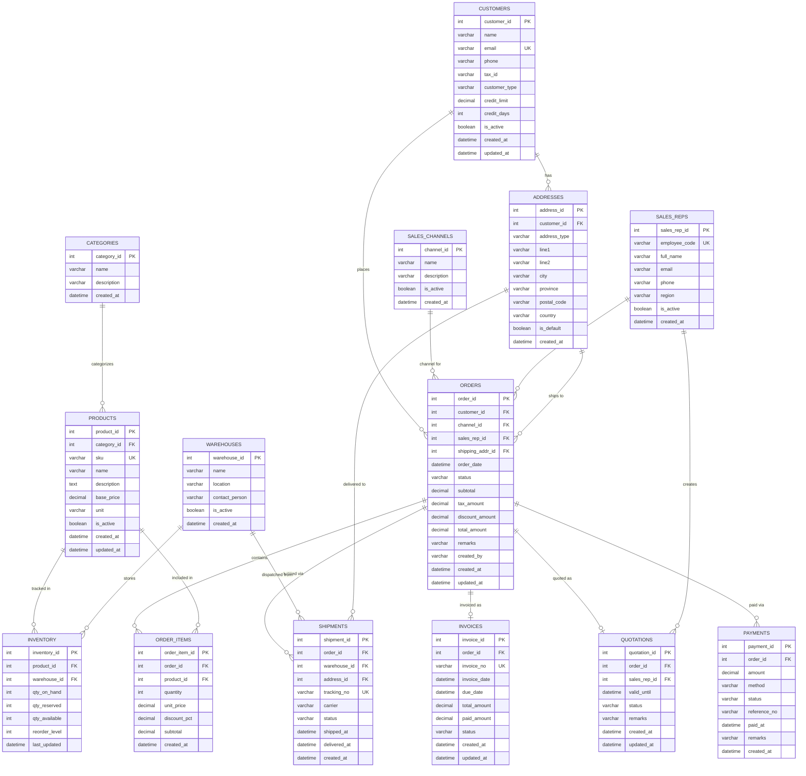

# Part 1: ER Diagram — ABC Trading ERP System

## Entity Relationship Diagram

---

## Entity Descriptions

| Entity | Key Attributes | Description |
|--------|---------------|-------------|
| **CATEGORIES** | `category_id`, `name` | Product groupings (e.g., Beverages, Snacks) |
| **PRODUCTS** | `sku` (UK), `base_price`, `category_id` | Master product catalog; no stock stored here |
| **WAREHOUSES** | `warehouse_id`, `location` | Physical storage locations |
| **INVENTORY** | `qty_on_hand`, `qty_reserved`, `qty_available` | Junction table (Products ↔ Warehouses); tracks live stock per location |
| **SALES_CHANNELS** | `name` — POS / SalesRep / Ecommerce | Channel master; extensible for future channels |
| **SALES_REPS** | `employee_code` (UK), `region` | Field sales representatives for B2B orders |
| **CUSTOMERS** | `customer_type` — Retail / Wholesale, `credit_limit`, `credit_days` | All customer accounts across channels |
| **ADDRESSES** | `address_type` — billing / shipping, `is_default` | Multiple addresses per customer; used for both ORDER and SHIPMENT |
| **ORDERS** | `channel_id`, `sales_rep_id` (nullable), `status`, `shipping_addr_id` | Unified order record; `status` = pending / paid / shipped / completed / cancelled |
| **ORDER_ITEMS** | `quantity`, `unit_price`, `discount_pct` | Line items resolving many-to-many between ORDERS and PRODUCTS |
| **QUOTATIONS** | `valid_until`, `status` — draft / sent / approved / expired | B2B only; converts to confirmed ORDER on approval |
| **PAYMENTS** | `method` — cash / credit_card / transfer / qr, `status` — pending / success / failed, `paid_at` | Multiple payments per order (supports partial / split payment) |
| **INVOICES** | `invoice_no` (UK), `due_date`, `paid_amount` | Tax invoices; tracks Accounts Receivable balance |
| **SHIPMENTS** | `tracking_no` (UK), `carrier`, `shipped_at`, `delivered_at` | Fulfillment records per warehouse dispatch |

---

## Key Design Decisions

| Decision | Rationale |
|----------|-----------|
| **INVENTORY as junction table** | Many-to-many between PRODUCTS and WAREHOUSES; stock never lives in PRODUCTS |
| **ADDRESSES as separate entity** | Customers can have multiple billing/shipping addresses; reused by both ORDERS and SHIPMENTS |
| **SALES_REPS linked to ORDERS** | `sales_rep_id` is nullable — only B2B orders have a rep; POS and e-commerce orders do not |
| **PAYMENTS supports multiple records per order** | Allows partial payments, installments, and retries on failure |
| **QUOTATIONS linked to ORDERS** | Quotation is a sub-state of an order (only in B2B); avoids duplicate order data |
| **`qty_available` computed field** | `qty_available = qty_on_hand - qty_reserved`; maintained on every reservation/release event |
| **`status` as varchar not enum** | Allows adding new statuses (e.g., `on_hold`, `backordered`) without schema migration |
| **Timestamps on every entity** | `created_at` and `updated_at` enable full audit trail and change tracking |
