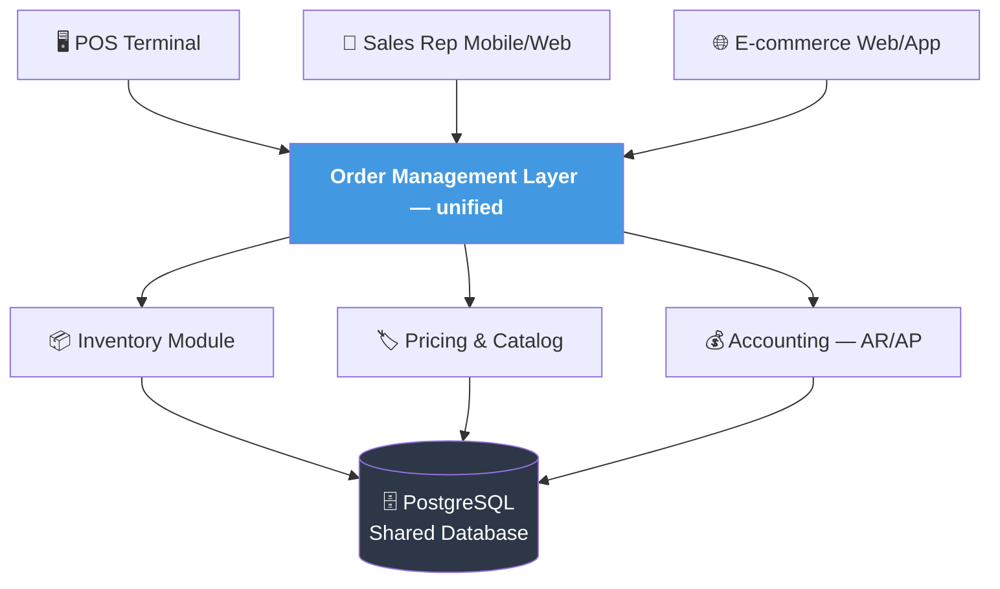
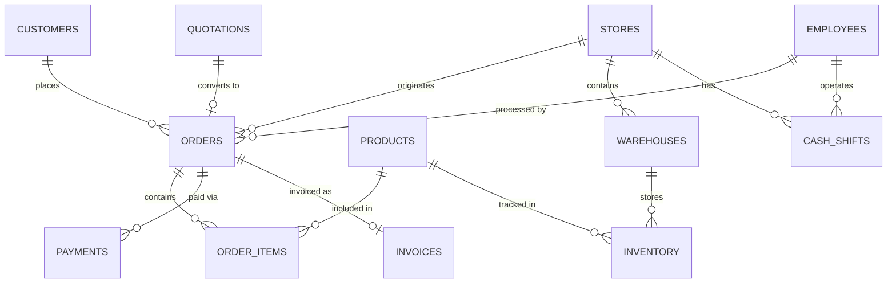
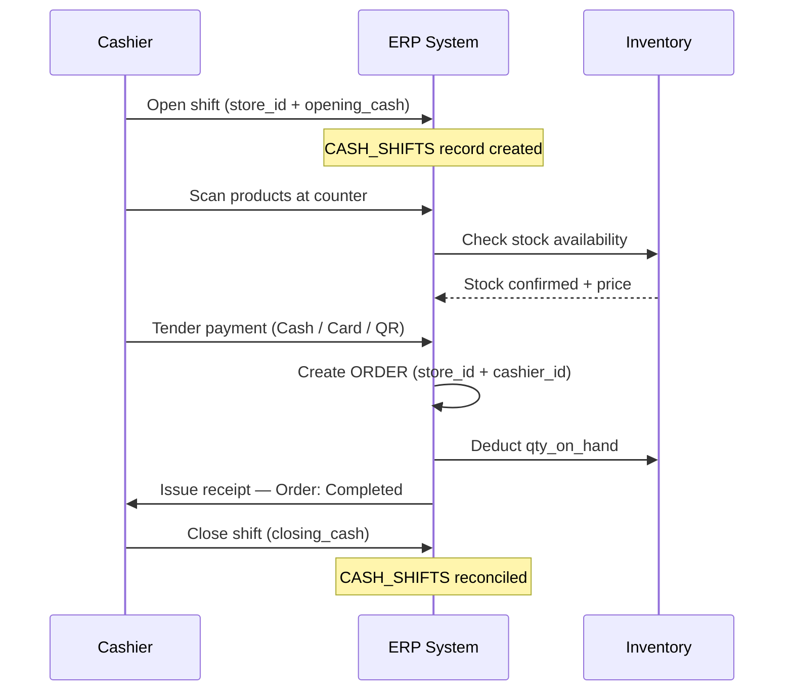
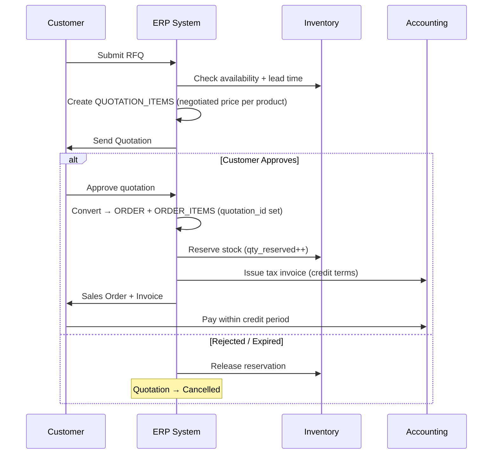
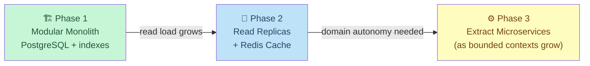

<!-- _class: lead -->

# ABC Trading ERP
## System Architecture Design

**Unified ERP · POS · Sales Rep (B2B) · E-commerce**

---

## Business Overview

**ABC Trading Co., Ltd.** — FMCG wholesale & retail operator across 3 sales channels

| Channel | Model | Payment Timing |
|---------|-------|----------------|
| **POS** | Walk-in retail store | Immediate at counter |
| **Sales Rep (B2B)** | Field sales to wholesale customers | Credit terms (Net 30 / 60) |
| **E-commerce** | Online web / mobile | Before shipment |

> **Problem:** Three channels operate independently — inconsistent data, duplicated processes, no unified view of inventory or AR.
> **Solution:** One ERP system. Single source of truth.

---

## System Objectives

- 📦 **Centralize** — sales, inventory, and financials in a single database
- 🔄 **Standardize** — shared order, payment, and fulfillment workflows across channels
- 👁 **Transparency** — real-time stock levels, order status, and AR balances
- 🏗 **Extensibility** — add channels, branches, or markets without redesign

---

## High-Level Architecture

> **Modular monolith** — single deployable unit, cleanly separated domains. No distributed systems complexity until it's needed.

---

## Data Model — Core Entities

> 18 entities total — simplified view shown. Full diagram in `er-diagram.md`.

---

## POS Workflow

---

## B2B Workflow — Quotation to Sales Order

---

## Key Design Decisions

| Decision | Rationale |
|----------|-----------|
| **INVENTORY as junction table** | PRODUCTS ↔ WAREHOUSES many-to-many; stock never stored in PRODUCTS |
| **`qty_available` not persisted** | Computed as `qty_on_hand − qty_reserved` at query time — eliminates stale reads under concurrent writes |
| **PAYMENT_TRANSACTIONS separate from PAYMENTS** | PAYMENTS = intent; TRANSACTIONS = gateway attempts. Retries insert a new row — no mutation, full idempotency |
| **QUOTATIONS independent of ORDERS** | Eliminates circular FK. `ORDERS.quotation_id` (nullable) references the source — lifecycle is unambiguous |
| **`store_id` + `cashier_id` nullable on ORDERS** | Single unified ORDERS table — POS populates both fields; B2B and e-commerce leave them NULL |
| **Pessimistic lock on INVENTORY** | `SELECT FOR UPDATE` on reservation prevents oversell under concurrent POS and online orders |

---

## Scalability Strategy

- **Phase 1** — Single deploy; domain modules enforce separation. Indexes on `orders(channel_id, status)`, `inventory(product_id, warehouse_id)`
- **Phase 2** — Read replicas for dashboards; Redis for inventory cache and POS session
- **Phase 3** — Extract Order, Inventory, Payment as services. Apply **CQRS** and **Event Sourcing** where audit depth matters

---

<!-- _class: lead -->

## Conclusion

| ✅ What the design gets right |
|-------------------------------|
| Unified order table across 3 channels — `channel_id` + nullable FKs |
| Inventory concurrency via pessimistic locking + DB-level constraints |
| Payment idempotency — `attempt_no` + gateway key, no mutation |
| Append-only audit tables — full traceability with zero update risk |
| POS operations cleanly added — `STORES`, `EMPLOYEES`, `CASH_SHIFTS` |
| Monolith-first — simple to deploy, clear path to microservices |

> **Design philosophy:** Start simple. Be explicit about trade-offs. Scale when the data proves it's needed.
